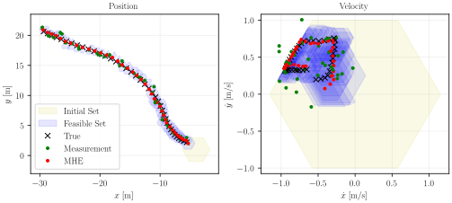

# ZonoOpt

This C++ header library provides classes for zonotopes, constrained zonotopes, and hybrid zonotopes. To use, `#include "ZonoOpt.hpp"`. All classes and methods are implemented using sparse linear algebra via the Eigen library. Generators may optionally have range [0,1] instead of [-1,1]. Templates are used to allow for either double or float data types.

Python bindings for the library can be built and installed using `pip install .`. The resulting python module is named `zonoopt`. To test that the module is working as intended, from the `test/unit-tests` directory, run `python3 unit_tests.py`. Note that a C++ compiler is required to build the module, and the Eigen submodule must be checked out (can be accomplished by running `python3 update_submodules.py`).

## Classes

### AbstractZono
Base class for points, zonotopes, constrained zonotopes, and hybrid zonotopes. Cannot be instantiated. For optimization methods, an ADMM_settings object may be passed as an optional input, and an ADMM_solution object may be passed as an optional output.
- **Methods**
    - `convert_form()`: converts between forms with generators $\xi \in [-1,1]$ vs. $\xi \in [0,1]$
    - `print()`
    - `remove_redundancy()`: removes linearly dependent constraints (assumed consistent) and unused generators
    - `optimize_over(P, q, c, settings, solution)`: solves $\min_x \frac{1}{2} x^T P x + q^T x + c$ such that $x \in \mathcal{Z}$ using ADMM. Optional arguments: `c`, `settings`, `solution`.
    - `x_proj = project_point(x, settings, solution)`: $\underset{x_p \in \mathcal{Z}}{\mathop{\text{argmin}}} \lVert x - x_p\rVert^2$. Optional arguments: `settings`, `solution`
    - `is_empty(Z, settings, solution)`: returns `true` if $\mathcal{Z} = \emptyset$. Optional arguments: `settings`, `solution`
    - `s = support(d, settings, solution)`: $\max_{x \in \mathcal{Z}} <x, d>$. Optional arguments: `settings`, `solution`
    - `contains_point(x, settings, solution)`: returns `true` if $x \in \mathcal{Z}$. Optional arguments: `settings`, `solution`
    - `bounding_box(settings, solution)`: returns bouding box of $\mathcal{Z}$ as a zonotope or point. Optional arguments: `settings`, `solution`
    - `is_point()`
    - `is_zono()`
    - `is_conzono()`
    - `is_hybzono()`
    

### Point
Point class

- **Constructor**: `Point(c)`
- **Methods**:
    - `set(c)`
    - `get_n()`
    - `get_c()`

### Zono
Zonotope class

- **Constructor**: `Zono(G, c, zero_one_form=false)`
- **Methods**:
    - `set(G, c, zero_one_form)`
    - `get_n()`
    - `get_nG()`
    - `get_G()`
    - `get_c()`
    - `is_0_1_form()`: true if xi in [0,1], false if xi in [-1,1]

### ConZono
Constrained zonotope class

- **Constructor**: `ConZono(G, c, A, b, zero_one_form=false)`
- **Methods**:
    - `set(G, c, A, b, zero_one_form)`
    - `get_n()`
    - `get_nG()`
    - `get_nC()`
    - `get_G()`
    - `get_c()`
    - `get_A()`
    - `get_b()`
    - `is_0_1_form()`: true if xi in [0,1], false if xi in [-1,1]

### HybZono
Hybrid zonotope class

- **Constructor**: `HybZono(Gc, Gb, c, Ac, Ab, b, zero_one_form=false)`
- **Methods**:
    - `set(Gc, Gb, c, Ac, Ab, b, zero_one_form)`
    - `convex_relaxation()`: returns convex relaxation of hybrid zonotope as constrained zonotope
    - `get_n()`
    - `get_nG()`
    - `get_nGc()`
    - `get_nGb()`
    - `get_nC()`
    - `get_G()`
    - `get_Gc()`
    - `get_Gb()`
    - `get_c()`
    - `get_A()`
    - `get_Ac()`
    - `get_Ab()`
    - `get_b()`
    - `is_0_1_form()`: true if xi in [0,1], false if xi in [-1,1]

### ADMM_solver
Solves quadratic programs of the form $\min_x \frac{1}{2} x^T P x + q^T x + c$ such that $Ax = b$, $x^l \leq x \leq x^u$.

- **Constructor**: ADMM_solver()
- **Methods**:
    - `setup(P, q, A, b, x_l, x_u, settings, c)`: c=0 if not specified, only affects final cost
    - `update_P(P)`
    - `update_q(q)`
    - `update_A(A)`
    - `update_b(b)`
    - `update_bounds(x_l, x_u)`
    - `update_c(c)`
    - `update_settings(settings)`
    - `warmstart(x0, u0)`: warm start primal and dual variables
    - `factorize()`: optional pre-factorization of matrices
    - `solve()`: solve optimization problem

## Structures

### ADMM_settings
Settings for ADMM_solver

- **Fields**:
    - `rho`: ADMM penalty parameter [default 1]
    - `t_max`: max solution time [default $\infty$]
    - `k_max`: max iterations [default 5000]
    - `eps_dual`: dual residual convergence tolerance [default 1e-2] 
    - `eps_prim`: primal residual convergence tolerance [default 1e-2]
    - `k_inf_check`: check for infeasibility certificate every `k_inf_check` iterations [default 10]
    - `inf_norm_conv`: if true, uses infinity norm of residuals to check convergence. If false, uses 2-norm scaled by the square root of the number of states. [default false]
    - `verbose`: CAUTION: setting this true can significantly increase solution times when called from Python [default false]
    - `verbosity_interval`: print every `verbosity_interval` ADMM iterations when `verbose`=true [default 10]
 
### ADMM_solution
Solution struct for ADMM_solver

- **Fields**:
    - `x`: primal solution
    - `z`: primal solution ($x \approx z$ at optimum)
    - `u`: dual solution
    - `J`: cost
    - `primal_residual`
    -  `dual_residual`
    - `run_time`: total solution time
    - `startup_time`: time spent doing matrix factorizations etc. prior to first iteration
    - `k`: number of iterations
    - `converged`: convergence flag
    - `infeasible`: infeasibility certificate found

## Typedefs

- `ZonoPtrF` = `std::unique_ptr<AbstractZono<float>>`
- `ZonoPtrD` = `std::unique_ptr<AbstractZono<double>>`

## Functions
- `Z_o` is returned as a `ZonoPtrF` or `ZonoPtrD`

### Set Operations

- `Z_o = affine_map(Z, R, s=Eigen::Vector<float_type,-1>())`: $\mathcal{Z}_o = R \mathcal{Z} + s$
- `Z_o = project_onto_dims(Z, dims)`: equivalent to affine map with `dims` vector selecting dimensions
- `Z_o = minkowski_sum(Z1, Z2)`: $\mathcal{Z}_o = \mathcal{Z}_1 \oplus \mathcal{Z}_2$
- `Z_o = pontry_diff(Z1, Z2)`: $\mathcal{Z}_o = \mathcal{Z}_1 \ominus \mathcal{Z}_2$
- `Z_o = intersection(Z1, Z2, R=Eigen::SparseMatrix<float_type>())`: $\mathcal{Z}_o = \mathcal{Z}_1 \cap_R \mathcal{Z}_2$. `R=I` if left empty.
- `Z_o = intersection_over_dims(Z1, Z2, dims)`: performs generalized intersection over selected dimensions of `Z1`
- `Z_o = halfspace_intersection(Z, H, f, R=Eigen::SparseMatrix<float_type>())`: $\mathcal{Z}_o = Z \cap_R \left\\{ x \middle| Hx \leq f \right\\}$. `R=I` if left empty.
- `Z_o = union_of_many({Z1, Z2, ..., Zn})`: $\mathcal{Z}_o = \bigcup _{i=1}^n \mathcal{Z}_i$
- `Z_o = cartesian_product(Z1, Z2)`: $\mathcal{Z}_o = \mathcal{Z}_1 \times \mathcal{Z}_2$

### Setup Functions

- `Zc = vrep_2_conzono(V)`: `V` is `nV x n` `Eigen::Matrix<float_type,-1,-1>` where `n` is the polytope dimension
- `Zh = vrep_2_hybzono({V1, V2, ..., Vn})`: `Vi` are `nV x n` `Eigen::Matrix<float_type,-1,-1>` where `n` is the polytope dimension.
- `Zh = zono_union_2_hybzono({Z1, Z2, ..., Zn})`: `Zi` are zonotopes
- `Z = make_regular_zono_2D(radius, num_sides, outer_approx, c)`: makes a regular zonotope with specified radius and number of sides centered at `c`. If `outer_approx` is `true`, then Z_o contains the circle of specified radius centered at `c`. Otherwise, the circle contains `Z_o`.  Optional arguments: `outer_approx` [default false], `c`.
